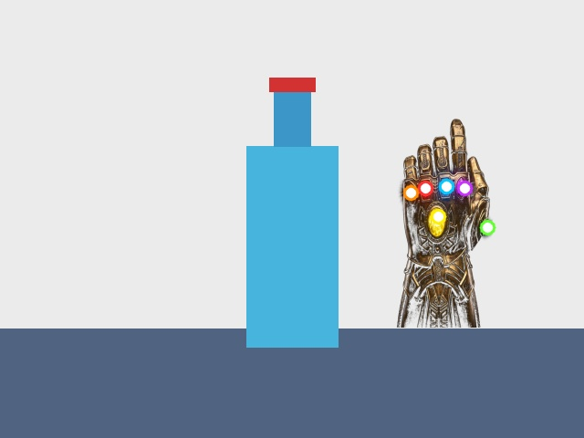
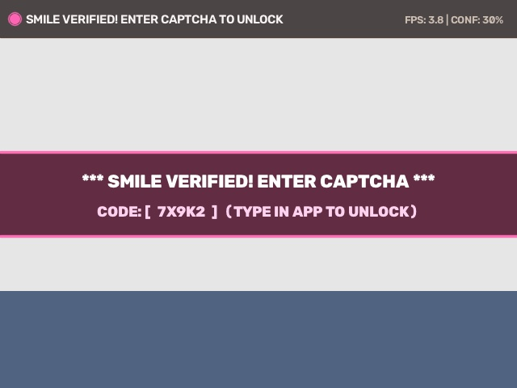
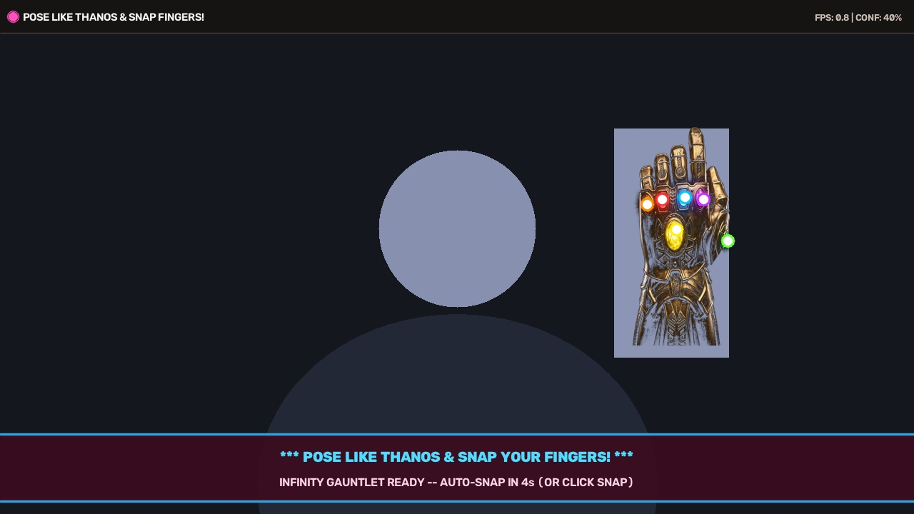

# Farzins tracker 🎯

## Basic Details
### Team Name: farzins tracker

### Team Members
- Team Lead: Farzin Salam VT - College of Engineering karunagappallly

### Project Description
BottleVision AI is an absurdly over-engineered computer vision guardian that turns drinking water into an extreme 4-stage security clearance. Using real-time YOLOv8 tracking, it blasts the deafening Malayalam "Kathi Thazhe Idada" (Kireedam) police alarm if unauthorized hands touch your bottle. To take a sip, you must verify your smile with facial AI, solve a 4-letter CAPTCHA, and execute an Augmented Reality Thanos Infinity Gauntlet snap before water access is unlocked.

### The Problem (that doesn't exist)
Drinking water is recklessly easy and dangerously unregulated. Today, anyone—roommates, nosy classmates, or thirsty friends—can casually reach out, grab your ₹20 plastic bottle, and drink your precious H2O without signing a biometric clearance, proving emotional worthiness, or facing any cinematic consequences. 

The complete lack of military-grade neural surveillance, high-stakes cryptographic CAPTCHAs, and celestial Marvel-level authorization on desk water bottles is an international crisis that absolutely nobody asked to be solved.

### The Solution (that nobody asked for)
We built **BottleVision AI**: an absurdly over-engineered, military-grade computer vision defense system that turns drinking 200ml of water into a 4-stage Marvel boss battle:

1. 👁️ **24/7 YOLOv8 Sentry:** A neural network watches your bottle in real-time. If an unauthorized hand dares to touch or move it, the system unleashes red police sirens and blasts the legendary Malayalam dialogue: *"കത്തി താഴെയിടെടാ!" (Kathi Thazhe Idada)* at 100% volume.
2. 😊 **Proof of Happiness (Smile Verification):** Want a sip? YuNet facial AI first forces you to smile with at least 80% genuine joy to prove you are emotionally worthy of hydration.
3. 🔤 **Cryptographic 4-Letter CAPTCHA:** A randomized, distorted visual puzzle to mathematically confirm you are a human and not a rogue hydration bot.
4. 🧤 **The AR Thanos Snap:** Stand before the camera and strike the Thanos pose. YOLOv8-Pose tracks your hand, overlays an Augmented Reality Infinity Gauntlet, plays the dramatic *"And I... am... Iron Man"* dialogue, disintegrates the screen into cosmic dust, and finally proclaims: **"YOU CAN DRINK WATER NOW"**.

## Technical Details
### Technologies/Components Used
For Software:
- **Languages used:**
  - Python 3.10+
  - Batch Scripting (`run.bat`)

- **Frameworks used:**
  - Ultralytics YOLOv8 (Deep Learning Computer Vision Framework)
  - OpenCV DNN Engine (Deep Neural Network Inference)
  - Finite State Machine (Anti-Theft Guardian State Controller)

- **Libraries used:**
  - `ultralytics` — Real-time bottle detection (`yolov8n.pt`) and human pose tracking (`yolov8n-pose.pt`)
  - `opencv-python` (`cv2`) — Camera streaming, computer vision filters, YuNet face detection & HUD overlays
  - `numpy` — Spatial vector math, bounding box IoU & coordinate calculations
  - `Pillow` (`PIL`) — Dynamic CAPTCHA generation, text rendering & AR RGBA alpha blending
  - `imageio-ffmpeg` — High-efficiency audio stream processing & format conversion
  - `winsound` / `subprocess` / `threading` — Multi-threaded zero-latency audio playback engine

- **Tools used:**
  - Git & GitHub — Source control & remote repository hosting
  - VS Code / Antigravity IDE — Development environment
  - YuNet ONNX Face Detection Model (`face_detection_yunet_2023mar.onnx`)
  - Haar Cascade Classifiers (`haarcascade_frontalface_default.xml`, `haarcascade_smile.xml`)
  - Pre-trained Neural Weights: `yolov8n.pt` & `yolov8n-pose.pt`

For Hardware:
- **Main components:**
  - **The High-Value Target:** 1x Standard Water Bottle (Plastic or Steel, 500ml–1000ml capacity)
  - **Host Machine:** Laptop / Desktop PC (Running the AI Guardian system)
  - **Optical Sensor:** Built-in Laptop Webcam or USB HD Webcam (Monitors the bottle defense perimeter)
  - **Acoustic Deterrent Unit:** Laptop Stereo Speakers or External Bluetooth Speaker (Blasts the 100dB Kireedam alarm & Thanos dialogue)
  - **Input Device:** Keyboard (For answering the high-stakes 4-letter security CAPTCHA)
  - **Biological Subject:** 1x Human (Equipped with smiling facial muscles and hand for Thanos snap)

- **Specifications:**
  - **Camera Resolution:** 720p / 1080p @ 30 FPS (Minimum 640x480 for real-time YOLO tracking)
  - **Processor (CPU):** Quad-Core Intel / AMD Processor (Runs neural inference at 25–30+ FPS)
  - **RAM:** Minimum 4GB (8GB recommended for concurrent YOLOv8 + Pose + YuNet models)
  - **Audio Output:** Stereo Sound Card with Windows Audio Subsystem (`winsound` / DirectX)
  - **Operating System:** Windows 10 / 11 64-bit

- **Tools required:**
  - Flat desk / table surface (Designated "Perimeter Defense Zone")
  - Ambient room lighting (Required for YuNet facial smile analysis)
  - USB Cable / Port (For external webcam or speakers, if used)
  - Zero soldering irons or screwdrivers needed (100% vision-powered AI hardware setup)

### Implementation
For Software:
# Installation
1. **Clone the repository:**
   bash
   git clone https://github.com/farzinsalam/farzin_traker0.git
   cd farzin_traker0
Create and activate a virtual environment (Recommended):

bash
# Windows (PowerShell / Command Prompt)
python -m venv .venv
.venv\Scripts\activate
# Linux / macOS
python3 -m venv .venv
source .venv/bin/activate
Install the required dependencies:

bash
pip install -r requirements.txt
Verify installation with the built-in self-test:

bash
python main.py --test
7:13 PM

# Run
### 1. Quick Launch (One-Click on Windows)
Simply double-click `run.bat` or run:
bash
run.bat
2. Standard GUI Dashboard
Launch the full interactive computer-vision control panel:

bash
python main.py
3. Direct Camera & Anti-Theft Guardian Mode
Launch directly into full-screen camera mode with the Anti-Theft Guardian pre-armed:

bash
python main.py --cli --guard
Keyboard Controls:
S ➔ Arm / Disarm the Anti-Theft Guardian
W ➔ Request Water (Initiates Smile Verification ➔ 4-Letter CAPTCHA ➔ Thanos Snap)
Space ➔ Save Snapshot to captures/
Q ➔ Exit application
4. Single Image Detection Mode
Test detection on a static image file without needing a webcam:

bash
python main.py --image sample_bottle.jpg
5. Automated System Self-Test
Run a diagnostic test across all models, sound engines, and AR pipelines:

bash
python main.py --test

### Project Documentation
For Software:
#

*Figure 1: 24/7 Bottle Perimeter Armed HUD — Real-time YOLOv8 neural tracking, bounding box perimeter lock, and security telemetry.*

*Figure 2: Multi-Factor Hydration Authentication — YuNet facial smile percentage analysis paired with a randomized 4-letter cryptographic security CAPTCHA.*

*Figure 3: Thanos AR Gauntlet & Water Unlock — YOLOv8-Pose hand tracking with Augmented Reality Infinity Gauntlet overlay, countdown timer, snap disintegration effect, and the final "YOU CAN DRINK WATER NOW" confirmation.*
---
# Diagrams
### Architecture & Security Workflow Diagram
mermaid
flowchart TD
    A([Start: Bottle Placed on Desk]) --> B[YOLOv8 Neural Network Scans Scene]
    B --> C{Bottle Position Stored & Monitored}
    
Theft Subsystem
    C -->|Unauthorized Hand Reaches / Bottle Moved| D[THEFT DETECTED!]
    D --> E[Red Flashing HUD Siren Activated]
    E --> F[Audio Engine Blasts: 'കത്തി താഴെയിടെടാ!' Kireedam Alarm]
    F --> C
    %% Authentication Subsystem
    C -->|User Presses 'W' / Asks for Water| G[Initiate Multi-Factor Hydration Auth]
    
 Stage 1: Smile
    G --> H[Stage 1: Smile Verification]
    H --> I[YuNet AI Scans Face & Mouth Ratio]
    I --> J{Smile >= 80% Worthy?}
    J -->|No| H
    J -->|Yes| K[Stage 2: 4-Letter Security CAPTCHA]
    %% Stage 2: CAPTCHA
    K --> L[Generate Distorted 4-Letter Code]
    L --> M{User Inputs Valid 4 Letters?}
    M -->|Incorrect| K
    M -->|Correct| N[Stage 3: Thanos Snap Protocol]
    %% Stage 3: Thanos Snap
    N --> O[YOLOv8-Pose Detects Hand & Arm Pose]
    O --> P[Render AR Infinity Gauntlet Overlay]
    P --> Q[Audio Dialogue: 'And I... am... Iron Man']
    Q --> R[3-2-1 Cosmic Snap Sequence]
    R --> S[Dust Particle Disintegration Effect]
    S --> T([HUD Notification: 'YOU CAN DRINK WATER NOW'])
Figure 4: Complete finite state machine and data flow diagram — from initial YOLOv8 bottle perimeter arming to the Kireedam alarm deterrent, smile verification, CAPTCHA validation, and the final AR Thanos Gauntlet snap sequence.

# Screenshots (Add at least 3)

Figure 1: Live BottleVision AI Dashboard & Active Guardian Sentry
The system in live webcam surveillance mode at 27.7 FPS. YOLOv8 has localized the Green Valley water bottle (FARZIN'S BOTTLE), while the Anti-Theft Guardian is actively armed (GUARDIAN ACTIVE: 1 SECURE). The control panel displays real-time telemetry, the "Kathi Thazhe Idada" alarm mode, and the 3 authentication triggers: Smile to Unlock, Security CAPTCHA, and the Thanos Snap Finale.

Facial Landmark Tracking & Live Smile Verification Meter
YuNet deep neural network real-time facial analysis in action. The vision pipeline detects the user's face, tracks 5 key facial landmarks (eyes, nose, mouth corners), and calculates the mouth curvature ratio in real-time. The live HUD displays the dynamic progress bar (SMILE: 6% / 30%), holding access until the user genuinely smiles to prove emotional worthiness.

Multi-Factor Hydration Authentication — Smile Verification & 4-Letter Security CAPTCHA
The user has successfully passed the facial emotion smile check (SMILE VERIFIED!). The system immediately transitions to Stage 2, generating a randomized, distorted 4-letter cryptographic CAPTCHA (FZUA). The code is projected onto the live HUD and in the control panel, requiring manual cognitive verification before water clearance can proceed.

AR Infinity Gauntlet Pose Tracking & Countdown
YOLOv8-Pose tracking the user’s arm and wrist keypoints in real-time. When the user raises their hand into the snap pose, the system dynamically overlays the Augmented Reality Infinity Gauntlet with all 6 glowing Infinity Stones. A 3-second hold countdown initiates alongside the dramatic "And I... am... Iron Man" dialogue.

# Diagrams

### System Architecture & Security Workflow

mermaid
flowchart TD
    Start([User Places Water Bottle on Desk]) --> YOLO[YOLOv8 Neural Network Scans Scene]
    YOLO --> Arm{Guardian Armed?}
    
  ARMING
    Arm -->|Yes| Lock[Lock Bottle Baseline Coordinates & Perimeter]
    
  BRANCH 1: THEFT DETECTED
    Lock -->|Unauthorized Hand Approaches / Bottle Shifted| Theft[🚨 THEFT DETECTED!]
    Theft --> Siren[Activate Red Emergency Flashing HUD]
    Siren --> Alarm[Audio Engine Blasts: 'കത്തി താഴെയിടെടാ!' Kireedam Siren]
    Alarm --> Lock
    
   BRANCH 2: AUTHENTICATION REQUEST
    Lock -->|User Presses 'W' / 'I Want Water'| Auth[Initiate Multi-Factor Hydration Clearance]
    
STAGE 1: SMILE
    Auth --> Step1[Stage 1: Smile Verification]
    Step1 --> FaceAI[YuNet Facial Neural Network Analyzes Face]
    FaceAI --> SmileCheck{Smile Ratio >= 80%?}
    SmileCheck -->|No| Step1
    SmileCheck -->|Yes| Step2[Stage 2: 4-Letter Security CAPTCHA]
    
 STAGE 2: CAPTCHA
    Step2 --> GenCap[Generate Randomized Distorted 4-Letter Code]
    GenCap --> CapCheck{User Inputs Correct 4 Letters?}
    CapCheck -->|Incorrect| GenCap
    CapCheck -->|Correct| Step3[Stage 3: Thanos Snap Protocol]
    
   STAGE 3: THANOS
    Step3 --> PoseTrack[YOLOv8-Pose Detects Arm & Wrist Keypoints]
    PoseTrack --> Gauntlet[Overlay AR Infinity Gauntlet with 6 Stones]
    Gauntlet --> Audio[Play Audio Dialogue: 'And I... am... Iron Man']
    Audio --> Countdown[Hold Pose: 3-Second Snap Countdown]
    Countdown --> Snap[Cosmic Snap & Dust Particle Disintegration Effect]
    Snap --> Granted[🟢 Notification: 'YOU CAN DRINK WATER NOW!']
    Granted --> Timer[15-Second Hydration Window]
    Timer --> Lock

### Project Demo
# Video
[Add your demo video link here]
*Explain what the video demonstrates*

# Additional Demos
[Add any extra demo materials/links]

---
Made with ❤️ at TinkerHub Useless Projects 

